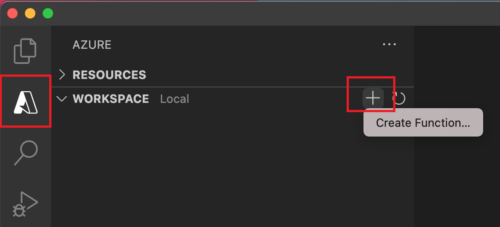
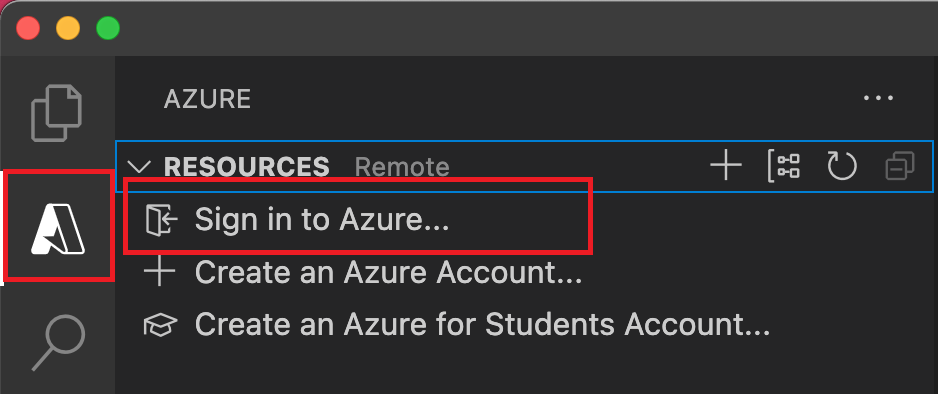
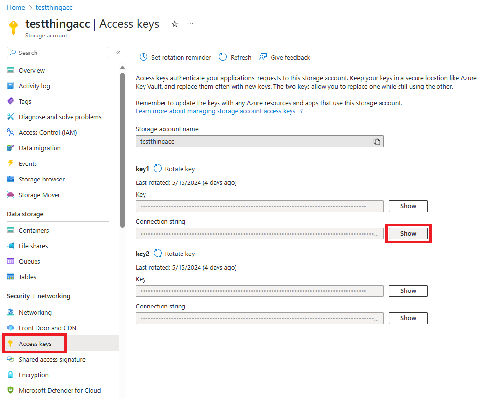
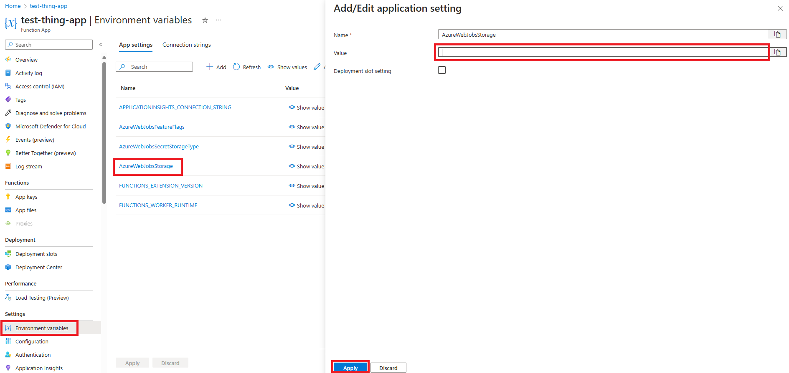
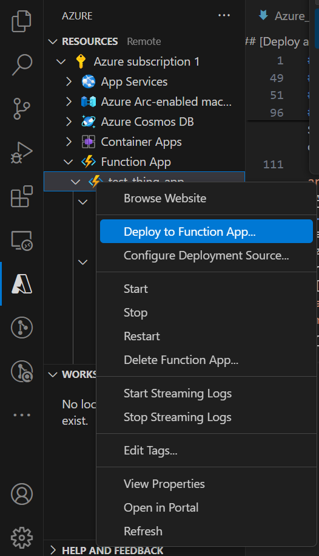
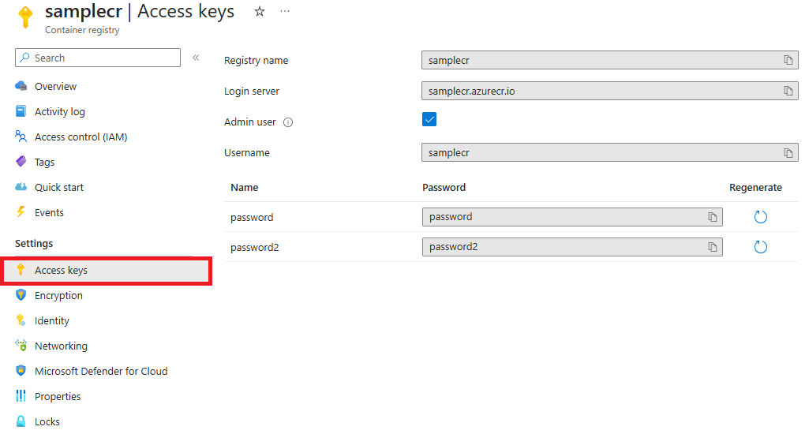

# Azure Services

- [Static Web Apps](#static-web-apps)
    - [Deployment using the Visual Studio Code extension](#deploy-an-application-using-the-visual-studio-code-extension)
    - [Deployment with Azure portal and Azure DevOps](#deploy-an-application-with-azure-portal-and-azure-devops)
    - [Deployment with SWA CLI](#deploy-an-application-with-swa-cli)
- [Function App](#function-app)
    - [Deployment using the Visual Code extension](#deploy-a-function-through-the-visual-studio-code-extension)
- [Container Registry](#container-registry)
    - [Configure Function App to work with Container Registry](#configure-function-app-to-work-with-container-registry)


## Static Web Apps

### [Deploy an application using the Visual Studio Code extension](https://learn.microsoft.com/en-us/azure/static-web-apps/getting-started?tabs=vanilla-javascript)

#### GitHub

1. Create a repository on GitHub
    - The repository you create in this step should include at least a single *index.html* file
2. Clone the repository
    - Replace `<YOUR_GITHUB_ACCOUNT_NAME>` with your GitHub username
```sh
git clone https://github.com/<YOUR_GITHUB_ACCOUNT_NAME>/my-first-static-web-app.git
```

#### Visual Studio Code

##### Install Azure Static Web Apps extension

1. Select View > Extensions
2. In the Search Extensions in Marketplace, type `Azure Static Web Apps`
3. Select Install for Azure Static Web Apps

##### Create a static web app

1. Inside Visual Studio Code, select the Azure logo in the Activity Bar to open the Azure extensions window

    - If you are not already authenticated in Azure and GitHub, the extension prompts you to sign in to both services during the creation process
2. Press the F1 key to open the Visual Studio Code command palette
3. Enter `Create static web app` in the command box
4. Select `Azure Static Web Apps: Create static web app...`
5. Select your Azure subscription
6. Enter your application name
7. Choose a region nearest to the client
8. Enter the settings values that match your application:

Setting | Value
-|-
Framework | Select **Custom**
Location of application code | Enter `\`
Build location | Leave blank

### [Deploy an application with Azure portal and Azure DevOps](https://learn.microsoft.com/en-us/azure/static-web-apps/get-started-portal?pivots=azure-devops&tabs=vanilla-javascript)

1. In the Azure portal, search for and create a new static web app
2. During the creation process, select "Azure DevOps" as the deployment source and select the DevOps repository and branch that contains the app
3. Select "Custom" for Build Presets, "/" for the App location, leave API location and Output location blank
4. Click the "Next: Advanced >" button, and then select the region closest to the client
5. Click the Review + create button and after passing the validation click the Create button

### [Deploy an application with SWA CLI](https://edi.wang/post/2022/11/17/deploy-to-azure-static-web-app-from-local-machine-without-github-action)

1. Initialization
```sh
swa init
```
2. Deployment
    - replace ./build with the directory of where you keep the build files
```sh
swa deploy ./build --env production
```


## Function App

### [Deploy a function through the Visual Studio Code Extension](https://learn.microsoft.com/en-us/azure/azure-functions/create-first-function-vs-code-python)

#### Azure Functions Core Tools

1. Press the F1 key to open the command palette
2. Search for and select `Azure Functions: Install or Update Core Tools`

#### Local

1. Choose the Azure icon in the Activity Bar and then in the **Workspace (local)** area, select the + button, choose **Create Function** in the dropdown
    - When prompted, choose **Create new project**

2. Choose the directory location for your project workspace and choose **Select**
    - You should either create a new folder or choose an empty folder for the project workspace
    - Don't choose a project folder that is already part of a workspace
3. Provide the following information at the prompts:

Prompt | Selection
-|-
Select a language | Choose `Python (Programming Model V2)`
Select a Python interpreter to create a virtual environment | Choose your preferred Python interpreter (If an option isn't shown, type in the full path to your Python binary)
Select a template for your project's first function | Choose `HTTP trigger`
Name of the function you want to create | Enter a name for your function
Authorization level | Choose `ANONYMOUS`, which lets anyone call your function endpoint
Select how you would like to open your project | Choose `Open in current window`

4. Open the local.settings.json project file and verify that the `AzureWebJobsFeatureFlags` setting has a value of `EnableWorkerIndexing`
5. In the local.settings.json file, update the `AzureWebJobsStorage` setting as in the following example
```JSON
"AzureWebJobsStorage": "UseDevelopmentStorage=true"
```

#### Start the Emulator

1. In Visual Studio Code, press the F1 key to open the command palette. In the command palette, search for and select `Azurite: Start`
2. Check the bottom bar and verify that Azurite emulation services are running, and if so, you can now run your function locally

#### Run the function locally

1. To start the function locally, press the F5 key or the Run and Debug icon in the left-hand side Activity bar
2. With the Terminal panel focused, press Ctrl + C to stop Core Tools and disconnect the debugger

#### Deployment

1. If you aren't already signed in, choose the Azure icon in the Activity bar, and then in the Resources area, choose **Sign in to Azure...**

2. Choose the Azure icon in the activity bar, and then in the **Resources** area, select the + icon and choose the **Create Function App in Azure** option
3. Provide the following information at the prompts:

Prompt | Selection
-|-
Select subscription | Choose the subscription to use, you won't see this prompt when you have only one subscription visible under **Resources**
Enter a globally unique name for the function app | Type a name that is valid in a URL path, the name you type is validated to make sure that it's unique in Azure Functions
Select a runtime stack | Choose the language version on which you've been running locally
Select a location for new resources | Choose a region nearest to the client

4. Go to the Azure portal and open your Azure Storage Account, select Access keys, and click on Show

5. In the Azure portal, open your Function App, select Environment variables, select AzureWebJobsStorage, enter the connection string in the Value input field, and click on Apply

6. In the **Resources** area of the Azure activity, locate the function app resource, right-click the resource, and select **Deploy to function app...**

7. When prompted about overwriting previous deployments, select **Deploy** to deploy your function code to the new function app resource


## Container Registry

### Configure Function App to connect with Container Registry

- As far as I could tell I could not find an exact Azure article for this situation but [this article](https://learn.microsoft.com/en-us/azure/azure-functions/functions-deploy-container?tabs=acr%2Cbash%2Cazure-cli&pivots=programming-language-python) was used as the main basis.

#### Prerequisites

- Dockerhub account
- Azure CLI

#### Configuration

The Function App must be using an App Service plan of basic or higher, this will not work with an App Service plan of free

1. Create an App Service Plan by running the command
	- Replace <RESOURCE_GROUP_NAME> with your Resource Group
	- Replace <APP_SERVICE_PLAN_NAME> with the App Service plan name of your choice
	- Replace <RESOURCE_LOCATION> with the location closest to the client, e.g., "eastasia"
```sh
az functionapp plan create --resource-group <RESOURCE_GROUP_NAME> --name <APP_SERVICE_PLAN_NAME> --location <RESOURCE_LOCATION> --number-of-workers 1 --sku B1 --is-linux
```
2. Create a Function App by running the command
	- Replace <FUNCTION_APP_NAME> with the Function App name of your choice
	- Replace <RUNTIME_STACK> with the runtime stack of your choice
    - If you want to specify the runtime version add the flag `--runtime-version` followed by the version number
```sh
az functionapp create --name <FUNCTION_APP_NAME> --storage-account <STORAGE_ACCOUNT_NAME> --resource-group <RESOURCE_GROUP_NAME> --plan <APP_SERVICE_PLAN_NAME> --runtime <RUNTIME_STACK>
```

#### Connection

1. On the portal, create an resource called Azure Container Registry
2. On your local function app type this command
	- The command creates the Dockerfile on existing Azure Function App
```sh
func init --docker-only
```
3. Build the image by running the command
	- Replace <DOCKER_ID> with your Docker ID from Dockerhub
	- Replace <IMAGE_NAME> with the image name of your choice
	- Replace <VERSION_NUMBER> with the version number, e.g., "v1.0.0"
```sh
docker build --tag <DOCKER_ID>/<IMAGE_NAME>:<VERSION_NUMBER> .
```
4. Test locally by running the command
```sh
docker run -p 8080:80 -it <DOCKER_ID>/<IMAGE_NAME>:<VERSION_NUMBER>
```
5. Log in your Azure account by running the command
	- Replace <CONTAINER_REGISTRY_NAME> with the name of your Container Registry
```sh
az acr login --name <CONTAINER_REGISTRY_NAME>
```
6. Tag the image by running the command
	- Replace <LOGIN_SERVER> with the Login Server found in your Container Registry access keys
```sh
docker tag <DOCKER_ID>/<IMAGE_NAME>:<VERSION_NUMBER> <LOGIN_SERVER>/<IMAGE_NAME>:<VERSION_NUMBER>
```
7. Push to the registry by running the command
```sh
docker push <LOGIN_SERVER>/<IMAGE_NAME>:<VERSION_NUMBER>
```
8. Use the following command to enable the built-in admin account so that Functions can connect to the registry with a username and password
```sh
az acr update -n <CONTAINER_REGISTRY_NAME> --admin-enabled true
```
9. On your Function App, head to environment variables and add the variables accordingly
    - The values can be found in the access keys for the Container Registry
    

Variable | Value
-|-
DOCKER_CUSTOM_IMAGE_NAME | <LOGIN_SERVER>/<IMAGE_NAME>:<VERSION_NUMBER>
DOCKER_REGISTRY_SERVER_URL | https://<LOGIN_SERVER>
DOCKER_REGISTRY_SERVER_USERNAME | <REGISTRY_USERNAME>
DOCKER_REGISTRY_SERVER_PASSWORD | <REGISTRY_PASSWORD>

- Note: When you make changes to your functions code project or need to update to the latest base image, you need to rebuild the container locally and republish the updated image to your chosen container registry. The following command rebuilds the image from the root folder with an updated version number and pushes it to your registry
```sh
az acr build --registry <CONTAINER_REGISTRY_NAME> --image <LOGIN_SERVER>/azurefunctionsimage:v1.0.1 .
```
